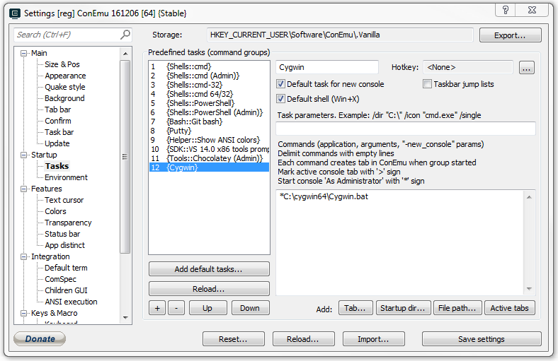

# Windows Development Tools & Tips

## Setting Up Windows for Use With *NIX Tools

### Cygwin

* Install [Cygwin](https://cygwin.com/install.html) and select the *minimum* amount of packages required for your setup
    - Some suggestions are to at least install _git_, _vim_, _tmux_, _openssh_, and _wget_
* Install [apt-cyg](https://github.com/transcode-open/apt-cyg/), a nice Cygwin package manager
    - To install, just grab the the bash script `apt-cyg` and `install apt-cyg /bin`

### ConEmu

* Install [ConEmu](http://conemu.github.io/)
* Create a Cygwin task that targets the main `Cygwin.bat` script

### Vim

If you have Vim configuration files, make sure they are put in the correct Windows directory to be found; this can be found in Vim by using the command `:echo $HOME` or `:echo $VIM` to find the home (`~` UNIX equivalent) or Vim system directory

## Native Windows Tools

### Sublime Text

#### Packages

* [Vintageous]: Vim emulator for Sublime Text
* [SublimeLinter]: Linter framework for multiple languages in Sublime Text
* [Git Gutter]: Shows git diff information in side bar of file
* [All Autocomplete]: Find autocompletions in any open file
* [Base16 Color Scheme]: Variety of color schemes

### Visual Studio

#### Plugins

* [VsVim](https://marketplace.visualstudio.com/items?itemName=JaredParMSFT.VsVim): Emulates Vim controls and keys to Visual Studio
* [MarkdownEditor](https://github.com/madskristensen/MarkdownEditor)
* [Trailing Whitespace Visualizer](https://marketplace.visualstudio.com/items?itemName=MadsKristensen.TrailingWhitespaceVisualizer): Visualize trailing whitespace with red blocks to easily remove them from source files
